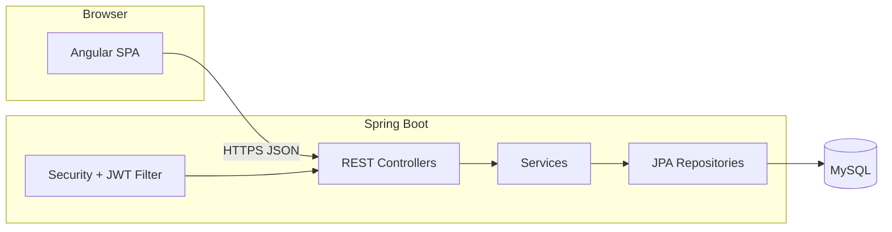
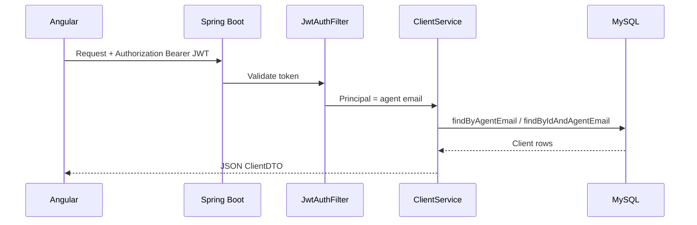

# Financial Advisor Client Management System — Project Documentation

## 1. Cover Page

| Field | Content |
|--------|---------|
| **Project Title** | Financial Advisor Client Management System (CMS Portal) |
| **Team Name** | *[Your team name]* |
| **Team Members & Roles** | *[Name — Role]* (e.g., Backend, Frontend, QA/Automation, Documentation) |
| **Tech Stack Summary** | **Frontend:** Angular 18, Angular Material, RxJS · **Backend:** Spring Boot 3.2, Java 17, Spring Security, JWT, JPA/Hibernate · **Database:** MySQL · **Automation:** Java, Selenium 4, Cucumber, TestNG, Extent Reports, Apache POI |
| **Submission Date** | March 29, 2026 |

---

## 2. Executive Summary

**Overview**

A full-stack **Financial Advisor Portal** where registered agents sign in, maintain a **private list of clients**, capture **KYC-style and investment profile** data, attach **identity documents**, and see a **server-calculated risk category** (Conservative / Moderate / Aggressive). The stack is an Angular SPA talking to a Spring Boot REST API with JWT auth and MySQL persistence. Optional **Selenium + Cucumber** tests automate login and client workflows using Excel-driven test data.

**Problem**

Advisors often rely on spreadsheets and ad hoc files, which hurts consistency, auditability, and secure multi-user use.

**Solution**

Centralized, role-scoped client records per agent, validated APIs, document storage in-database, and automated risk classification from questionnaire inputs.

**User impact**

Faster onboarding, clearer risk segmentation, and one place to view and update client data.

**Innovation (summary)**

Rule-based risk scoring combining tolerance, market-stress reaction, and experience; JWT-secured multi-tenant isolation by agent email; E2E automation with data-driven scenarios.

---

## 3. Problem Statement

**Real-world challenge**

Financial advisors need to collect structured client and compliance-related information, store supporting documents, and assess risk—without mixing clients across advisors or losing data integrity.

**Who is affected**

Financial advisors/agents, operations teams reviewing client files, and indirectly clients whose data must stay accurate and private.

**Evidence / examples**

- Mixed use of paper/Excel increases errors and duplicate entry.
- Multi-advisor firms need **per-agent data isolation**.
- Risk labels are often inconsistent without a **single scoring rule** applied on save.

---

## 4. Proposed Solution

**Description**

- **Web app:** Agents **sign up** or **log in**; the UI stores a **JWT** and calls protected APIs.
- **Client lifecycle:** List clients on a **dashboard**, **add/edit** via a rich form, **view details**, **delete**, **upload/download** a document per client.
- **Risk category:** Computed on **create/update** from investment amount, duration, risk tolerance, market-drop reaction, and investment experience (and fallbacks when some fields are absent).

**How it solves the problem**

Single system of record, validation on the server, documents tied to the client row, and each agent only sees **their** clients (filtered by authenticated agent).

**Unique value & innovation**

Transparent risk bucketing logic in `ClientService`, JWT + BCrypt security baseline, and Cucumber E2E with Excel-driven cases for repeatable demos and regression.

---

## 5. Use Cases

### UC1 — Agent registration

| Item | Detail |
|------|--------|
| **Actors** | Prospective agent |
| **Preconditions** | Backend and DB running; email not already registered |
| **Steps** | Open signup page → enter name, email, password → submit → session stored (token + agent name/email) → redirect to app |
| **Success** | HTTP 200, JWT returned, user can access protected routes |

### UC2 — Login

| Item | Detail |
|------|--------|
| **Actors** | Agent |
| **Preconditions** | Account exists |
| **Steps** | Open login → enter email/password → submit |
| **Success** | 200 + JWT; dashboard loads |

### UC3 — Create client

| Item | Detail |
|------|--------|
| **Actors** | Logged-in agent |
| **Preconditions** | Valid JWT |
| **Steps** | Dashboard → Add client → fill required fields → submit |
| **Success** | 201, client appears in list with **riskCategory** set |

### UC4 — View / edit / delete client

| Item | Detail |
|------|--------|
| **Actors** | Agent |
| **Preconditions** | Client owned by current agent |
| **Steps** | Open row actions → view or edit or confirm delete |
| **Success** | Correct CRUD responses; list refreshes |

### UC5 — Upload / download document

| Item | Detail |
|------|--------|
| **Actors** | Agent |
| **Preconditions** | Client exists |
| **Steps** | Upload file via UI → download from client details |
| **Success** | File stored as LONGBLOB; download returns bytes with filename header |

---

## 6. Architecture & Design

**High-level architecture**

**Request sequence (authenticated API)**

**Technology stack details**

| Layer | Technology |
|--------|------------|
| UI | Angular 18, standalone components, Angular Material, HttpClient |
| API | Spring Web, Spring Data JPA, Bean Validation |
| Security | Spring Security (stateless), BCrypt, JWT (jjwt 0.11.5) |
| DB | MySQL, Hibernate `ddl-auto=update` |
| Automation | Selenium 4, Cucumber 7, TestNG, WebDriverManager, Extent Reports, POI |

---

## 7. Features & Capabilities

| Feature | Business value | Technical value |
|--------|----------------|-----------------|
| Agent signup/login | Onboard advisors without admin gate (demo) | JWT issuance, password hashing |
| Dashboard table | At-a-glance clients and risk | Material table, scoped GET |
| Client CRUD + validation | Data quality | `ClientDTO` constraints, `GlobalExceptionHandler` |
| Risk category | Consistent segmentation | Centralized `calculateRiskCategory` |
| Document upload/download | KYC file attachment | Multipart upload, LONGBLOB storage |
| Auth guard + HTTP interceptor | Protected SPA routes | Bearer token on API calls |
| E2E automation | Regression & demo confidence | Cucumber + Excel-driven steps |

---

## 8. Installation Guide

**System requirements**

- JDK 17
- Node.js LTS (compatible with Angular 18 CLI)
- MySQL Server (local or remote)
- Maven 3.x (backend & automation)
- Chrome/Chromium (for automation)

**Backend (`backend_cms`)**

1. Create database (optional): MySQL can be created via JDBC URL `…/advisor_portal?createDatabaseIfNotExist=true`.
2. Set **`application.properties`**: `spring.datasource.url`, `username`, `password` for your environment. **Do not commit real production passwords.**
3. From `backend_cms`: `mvn spring-boot:run`
4. API base: `http://localhost:8080`

**Frontend (`frontend_cms`)**

1. `npm install`
2. `npm start` or `ng serve` → default `http://localhost:4200`
3. Ensure API URLs in `auth.service.ts` and `client.service.ts` match your backend (default `http://localhost:8080`).

**Database**

- Schema is generated/updated by Hibernate (`spring.jpa.hibernate.ddl-auto=update`).
- Tables include **`agents`** and **`clients`** (with `agent_id` FK).

**Environment variables**

The project uses **properties file** configuration rather than env-based profiles in-repo. For production, externalize `spring.datasource.*` and JWT secrets via environment or Spring Cloud Config.

---

## 9. User Manual

**Login**

1. Go to `/login`.
2. Enter email and password → submit.
3. On success, you are redirected to the dashboard (`''`).

**Signup**

1. Go to `/signup`, complete the form → submit.
2. Session is stored; you can use the app as a logged-in agent.

**Input (add/edit client)**

1. From dashboard, use **Add** or open **Edit** for a client.
2. Complete required fields (name, DOB, contact, ID, investment fields, risk/KYC fields, etc.).
3. Save.

**Triggering workflow**

- Creating or updating a client triggers **risk category recalculation** on the server.
- Document upload is available from the client flow where implemented in the UI.

**Viewing outputs**

- **Dashboard:** table with id, name, phone, risk category, actions.
- **View:** `/view/:id` for client details; document download if present.

**Troubleshooting**

| Symptom | Check |
|--------|--------|
| 401 on API | Token missing/expired; log in again |
| CORS errors | Frontend must run on allowed origin (`http://localhost:4200` in `SecurityConfig`) |
| DB connection errors | MySQL running; URL/user/password correct |
| Validation errors | Response body lists field errors (400) |

---

## 10. Demo Instructions

| Item | Detail |
|------|--------|
| **Demo video link** | *[Insert URL]* |
| **Sample data** | Create an agent via signup; add a client with varied **risk tolerance**, **market drop reaction**, and **investment experience** to show **Conservative / Moderate / Aggressive**. For automation, use Excel cases referenced in Cucumber (e.g. `TC_01`, `TC_02`). |
| **Execution steps** | 1) Start MySQL → 2) Start backend → 3) Start Angular → 4) Signup/login → 5) Add client → 6) Show dashboard risk → 7) Optional: upload document → 8) Optional: `mvn test` in `automation_cms` with app URL and driver configured per project |

---

## 11. Innovation & Impact

- **Business:** Standardized client profiles and risk labels for advisor conversations and internal review.
- **User:** Single portal per agent with clear navigation (dashboard, add, view, edit).
- **Technical:** Stateless JWT API, JPA model with document binary storage, scoring logic in one service method.
- **Scalability:** Horizontal scaling of stateless API instances; MySQL can be clustered; large documents may eventually move to object storage.

---

## 12. Technical Details

**API specifications (summary)**

| Method | Path | Auth | Description |
|--------|------|------|-------------|
| POST | `/api/auth/signup` | No | Body: `name`, `email`, `password` → `AuthResponse` |
| POST | `/api/auth/login` | No | Body: `email`, `password` → `AuthResponse` |
| GET | `/api/clients` | JWT | All clients for current agent |
| GET | `/api/clients/{id}` | JWT | One client (scoped) |
| POST | `/api/clients` | JWT | Create; body `ClientDTO` |
| PUT | `/api/clients/{id}` | JWT | Update |
| DELETE | `/api/clients/{id}` | JWT | Delete |
| POST | `/api/clients/{id}/document` | JWT | `multipart/form-data` file |
| GET | `/api/clients/{id}/document` | JWT | Download bytes |

**Data models (conceptual)**

- **Agent:** `id`, `name`, `email` (unique), `password` (hashed).
- **Client:** identity, demographics, financial/investment fields, KYC flags, `documentData` / `documentName`, **many-to-one** `Agent`.

**Security**

- BCrypt passwords; JWT for API access; CSRF disabled (typical for stateless JWT APIs); CORS restricted to `http://localhost:4200` in code.

**Performance**

- Suitable for advisor-scale row counts; list endpoint loads all clients for the agent (consider paging for very large portfolios).

**Scalability**

- Add DB indexes on `agent_id` and lookups; externalize file storage if document volume grows.

---

## 13. Limitations

- **Known issues:** List endpoint returns all clients for the agent without pagination; global exception handler may surface internal messages in 500 responses (tighten for production).
- **Secrets:** Database credentials in `application.properties` in dev—**rotate and use secrets management for production**.
- **CORS:** Single dev origin; production needs deployed frontend URL(s).
- **Automation:** Depends on local Selenium/WebDriver and test data files; environment-specific.
- **Time constraints:** *[e.g., no email verification, no admin roles, no audit log]* — adjust to what you actually built.

---

## 14. Future Enhancements

- Pagination, search, and sorting on the dashboard.
- Role-based access (admin vs. advisor), email verification, password reset.
- Store documents in S3-compatible storage; virus scanning.
- Audit trail and export (CSV/PDF).
- OpenAPI/Swagger and integration tests.
- Production: HTTPS, hardened JWT config, environment-based config, health checks.

---

## 15. Conclusion

This portal delivers **secure, agent-scoped client management** with **structured investment/KYC fields**, **document storage**, and **automatic risk categorization**, backed by a **modern Angular + Spring Boot** stack and **optional E2E automation**. It is suitable as a **course or prototype** baseline and can evolve toward production with configuration, security, and scalability hardening.

**Final pitch:** *"One place for advisors to onboard clients, attach documents, and see consistent risk labels—API-first, JWT-secured, and ready to extend."*

---

## 16. Appendix

**A. API reference**

See Section 12; extend with request/response JSON examples from Postman collections if you add them.

**B. SQL scripts**

Hibernate **`ddl-auto=update`** manages schema. For manual DDL examples, mirror tables `agents` and `clients` with FK `clients.agent_id` → `agents.id`. Exact DDL can be captured from MySQL after first run (`SHOW CREATE TABLE`).

**C. Additional diagrams**

Reuse the mermaid diagrams from Section 6 in slides or export as images.
